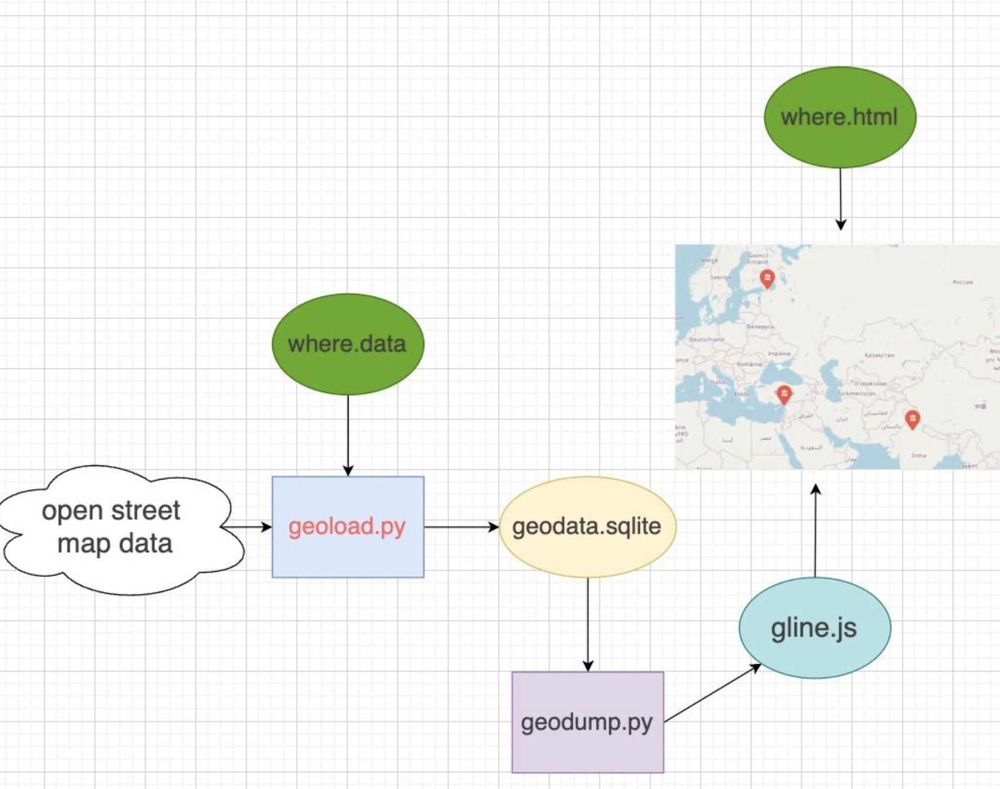

Using the OpenStreetMap API with the database and data visualization
on OpenStreetMap.

In this project, we use the free OpenStreetMap API (Nominatim service) to 
convert university names entered by users into geographical locations,
and then we place the processed data on the OpenStreetMap map.

Note: After Windows, we recommend that you use the PowerShell terminal so that it doesn't 
problems with displaying UTF-8 characters.

The program must be installed to view and modify the database
DB Browser for SQLite:

https://sqlitebrowser.org/

In the terms of using the Nominatim service there is an indication to agree to 
a maximum of one query per second (the service is free, hence if we
they generated a very large number of inquiries in a short time, probably quickly
we would be blocked from accessing the API). We divide our task into two phases.

In the first phase, we take our input from where.data and read it
them line by line while reading the server's geocoded response
Nominatim and store it in the database (opengeo.sqlite file). Before we use
Geocoding API, we just check if we already have data for this particular one
line, so we won't be able to restart the program
they had to query the API a second time.

At any time, you can start the entire process from scratch by simply deleting
the generated opengeo.sqlite file.

Run the geoload.py program. This program will read input lines from the file
where.data and check for each row to see if it's already in the database, and
if we do not have data for the location being processed, it will trigger an API query
geocoding to retrieve data and store it in SQLite.

Here is an example of a run after some are already in the database
data:

python3 geoload.py 

Found in database AGH University of Science and Technology

Found in database Academy of Fine Arts Warsaw Poland

Found in database American University in Cairo

Found in database Arizona State University

Found in database Athens Information Technology

Retrieving https://py4e-data.dr-chuck.net/opengeo?q=BITS+Pilani
Retrieved 794 characters {"type":"FeatureColl

Retrieving https://py4e-data.dr-chuck.net/opengeo?q=Babcock+University
Retrieved 760 characters {"type":"FeatureColl

Retrieving https://py4e-data.dr-chuck.net/opengeo?q=Banaras+Hindu+University
Retrieved 866 characters {"type":"FeatureColl

...

The first five locations are already in the database, and so are they
omitted. The program processes data until it finds unsaved
locations and starts asking the API for them.

The geoload.py file can be stopped at any time, plus the code
contains a counter (the variable 'count') that can be used to limit the number
connections to the geocoding API in a given program startup.

After the data has been loaded into opengeo.sqlite, you can visualize it with
geodump.py. This program reads the database and writes the where.js file
containing locations, latitudes, and longitudes in the form
JavaScript executable. The ZIP file you downloaded already contains
where.js generated, but you can generate it again to check
operation of the geodump.py program.

The geodump.py program is launched as follows:

python3 geodump.py

AGH University of Science and Technology, Czarnowiejska, Czarna Wieś, Krowodrza, Kraków,
Lesser Poland Voivodeship, 31-126, Poland 50.065703299999996 19.918958667058632
Academy of Fine Arts, Krakowskie Przedmieście, Northern Śródmieście,
Śródmieście, Warsaw, Masovian Voivodeship, 00-046, Poland 52.2397515
21.015564130658333
...
260 lines were written to where.js
Open the where.html file in a web browser to view the data.

The where.html file consists of HTML and JavaScript that are used for visualization
OpenStreetMap maps using the OpenLayers library. The page reads
the most recent data from the where.js file to get the data necessary for
visualization. Here is the format of the where.js file:

myData = [
[50.065703299999996,19.918958667058632, 'AGH University of Science and Technology, Czarnowiejs
ka, Czarna Wieś, Krowodrza, Kraków, Lesser Poland Voivodeship, 31-126, Poland '],
[52.2397515,21.015564130658333, 'Academy of Fine Arts, Krakowskie Przedmieście
e, Śródmieście Północne, Śródmieście, Warsaw, Masovian Voivodeship, 00-046,
Poland'],
   ...
];

This is a list of lists written in JavaScript. Language list syntax
JavaScript is very similar to Python syntax.

To see the locations on the map, open the where.html file in your browser
website. You can hover over each map pin and click on it,
so as to find the location that the encoding API returned for the input
entered by the user. If you don't see the where.html file when you open it
no data, check if JavaScript is enabled in the browser or in
your browser's development console, check if there are any errors.

